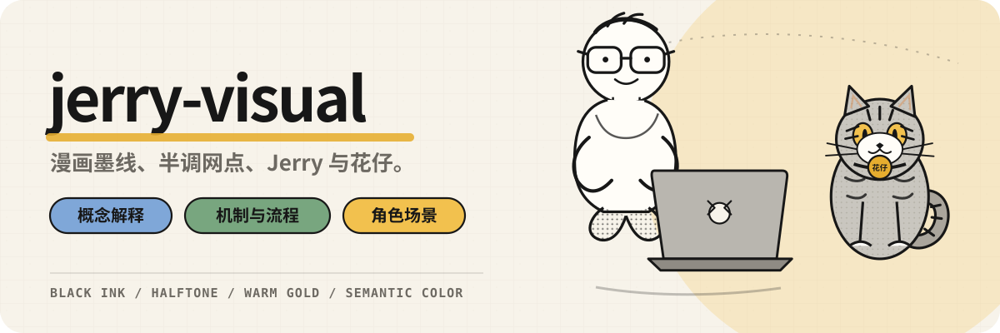
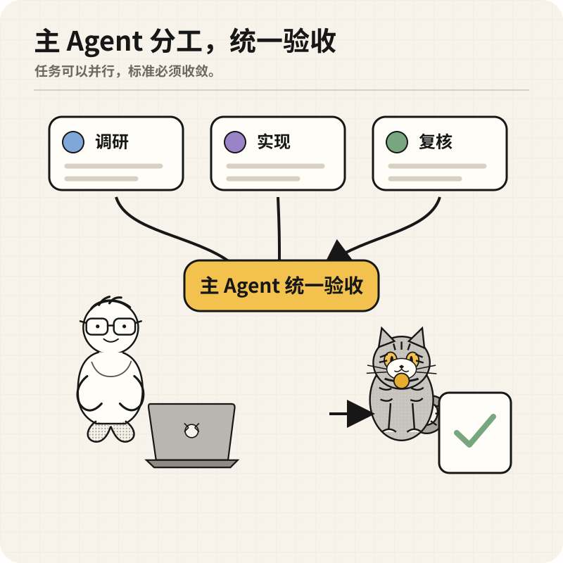
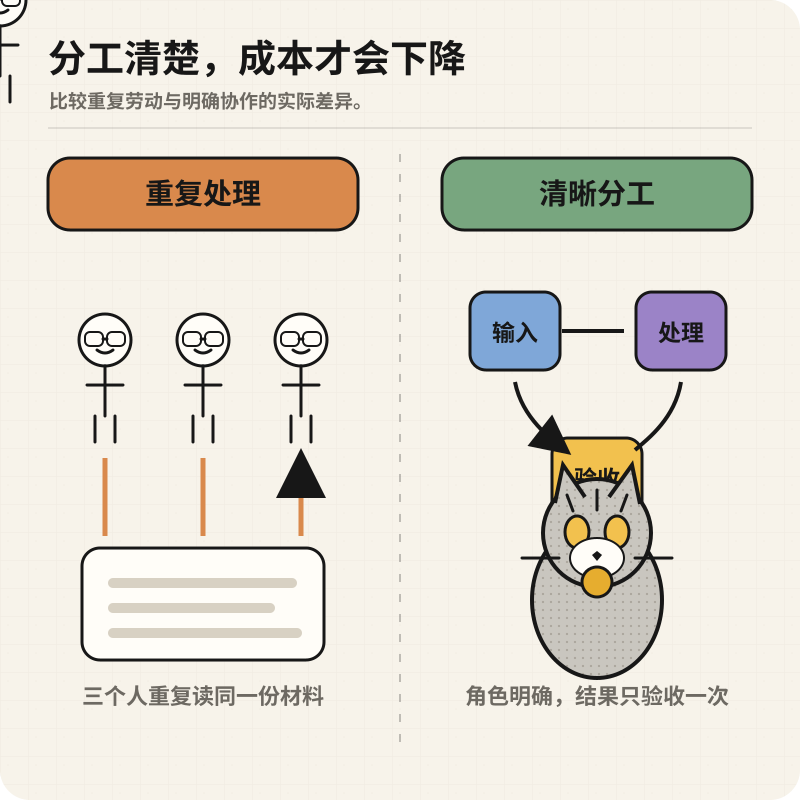
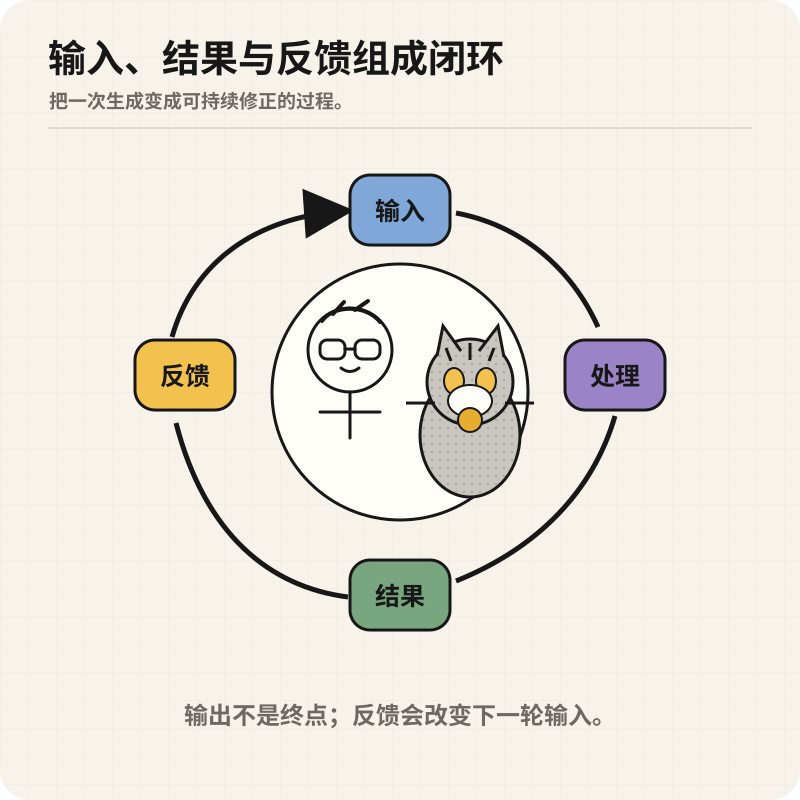
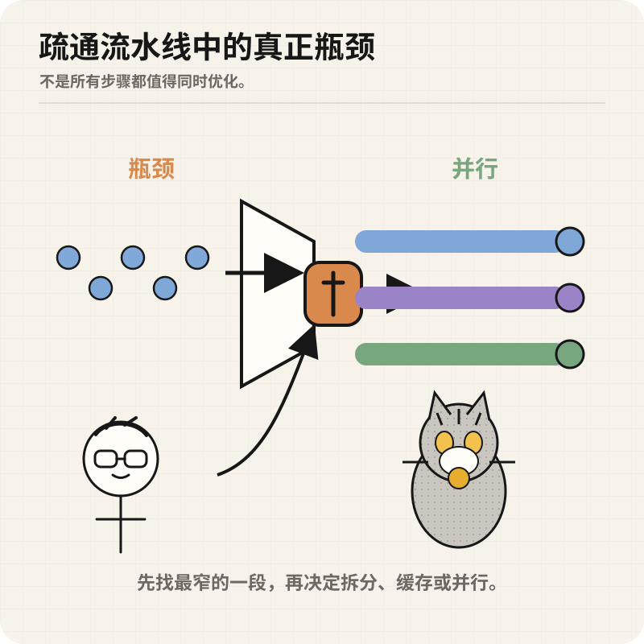
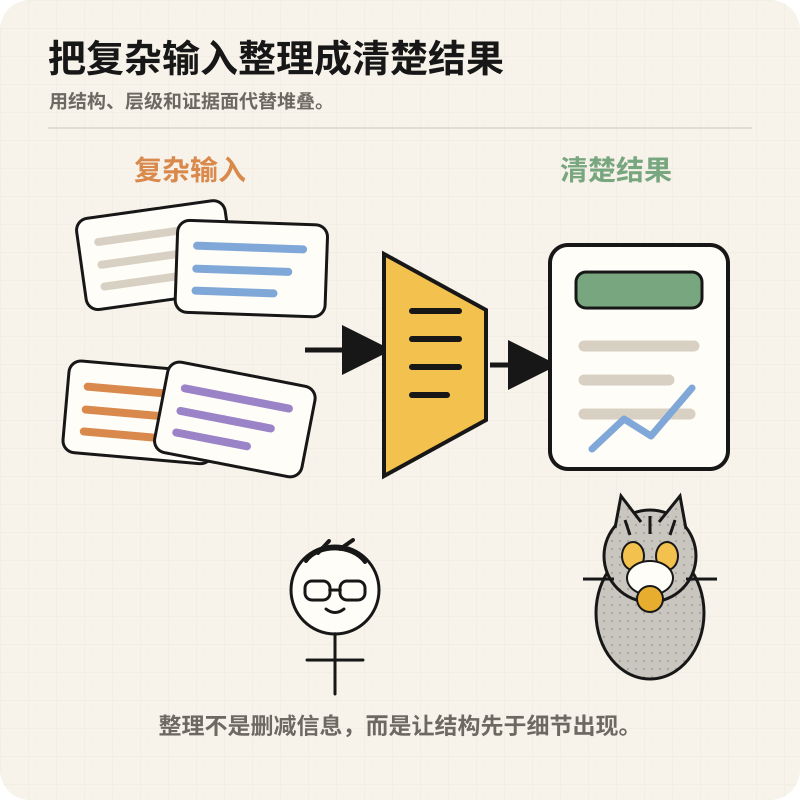
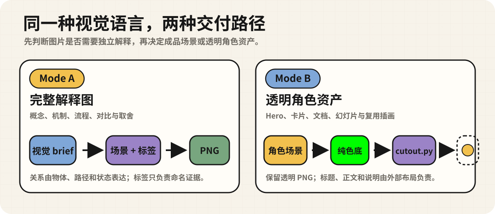

<p align="center">
  
</p>

<p align="center">
  <strong>给 Codex 使用的统一配图 Skill。</strong><br>
  用同一套角色、墨线、半调、颜色和标签规则，生成可解释的机制图与可复用的透明插画。
</p>

<p align="center">
  <a href="#先看效果">先看效果</a> ·
  <a href="#两种输出模式">输出模式</a> ·
  <a href="#安装">安装</a> ·
  <a href="#第一次使用">第一次使用</a> ·
  <a href="./SKILL.md">完整规范</a>
</p>

## 先看效果

<p align="center">
  
  
  
</p>

<p align="center"><sub>任务分工 · 成本对比 · 闭环反馈</sub></p>

<p align="center">
  
  
</p>

<p align="center"><sub>流水线瓶颈 · 从复杂到清楚</sub></p>

五张图处理的是不同问题，但使用同一套视觉语法：**粗细分明的黑色墨线、圆形半调网点、暖米白纸面、克制的语义色，以及 Jerry 与花仔组成的角色锚点。**

角色不是装饰。它们只在需要时参与观察、操作或验收，真正负责解释关系的仍然是物体、路径、状态和结果。

## 角色锚点

**Jerry** 保留极简小人的基本轮廓：圆头、点眼、简单微笑、细线四肢和少量发丝。唯一明显的个性化调整是把原来的圆框眼镜轻微改成更接近 Jerry 的圆角方框；不画成写实肖像，也不保留参考照片里的帽子。

**花仔** 是豹猫 × 狸花猫混血，在这套风格里被压缩成稍胖、紧凑的银灰色线条角色：黄眼、浅色口鼻、少量额头与腿部条纹、克制的不规则体纹、环纹尾巴和金色吊牌。它不是普通灰色虎斑，也不会被夸张成满身豹纹的纯种豹猫。

## 它统一了什么

| 层级 | 固定规则 |
| --- | --- |
| 角色 | 极简 Jerry 与稍胖的花仔保持相同抽象程度，不混用写实人物或写实宠物 |
| 线条 | 黑色墨线承担轮廓和关键细节，线宽有层级但不使用松散草稿线 |
| 明暗 | 灰面和阴影使用圆形半调网点，不用柔和空气感渐变 |
| 颜色 | 黑、白、灰为主体；暖金用于花仔的眼睛、吊牌和少量强调；每张图最多再使用两种语义色 |
| 文字 | 只放短而准确的标签，并直接贴近对应证据面；长文、命令和表格留在 Markdown |
| 场景 | 只保留帮助理解的物件，例如文档、终端、流程、文件夹、工具和结果产物 |

## 两种输出模式

<p align="center">
  
</p>

| 模式 | 适用场景 | 交付物 |
| --- | --- | --- |
| **Mode A · 完整解释图** | 概念、机制、流程、比较、取舍 | 带完整场景和必要标签的 PNG / WebP |
| **Mode B · 透明角色资产** | README Hero、卡片、文档、幻灯片或其他外部布局 | 纯色背景源图，经 `scripts/cutout.py` 处理后的透明 PNG |

Mode A 要求图片脱离上下文后仍能说明主要关系。Mode B 则把说明职责交给外部布局，只保留可复用的角色与必要道具。

## 安装

```bash
git clone https://github.com/jry21223/jerry-visual.git ~/.codex/skills/jerry-visual
```

重启 Codex，然后在对话中点名使用 `$jerry-visual`。

## 第一次使用

### 解释一个机制

```text
Use $jerry-visual in Mode A to explain how the main Agent assigns
research, implementation, and review to parallel workers, then performs
one final acceptance check.

Use the exact Chinese labels: "调研", "实现", "复核", "统一验收".
```

### 做一个对比图

```text
Use $jerry-visual in Mode A to compare repeated processing with clear
role separation. Keep Jerry and 花仔 secondary to the evidence.
```

### 生成透明角色资产

```text
Use $jerry-visual in Mode B to draw the minimal glasses character
reviewing a blueprint with 花仔 sitting beside him.

Use a perfectly uniform #00FF00 background and remove it with
scripts/cutout.py. Do not add text.
```

## 交付检查

生成完成后至少检查四件事：

1. 不看标签时，主要关系是否仍然成立；
2. Jerry 是否仍是极简线条角色，眼镜调整是否足够克制；
3. 花仔是否稍胖、以银灰为主、花纹克制，并保留黄眼、浅口鼻、环纹尾和金色吊牌；
4. 标签是否逐字正确、只出现一次，并在目标尺寸下可读。

完整的提示词结构、重试方式、抠图参数和质量门槛都写在 [`SKILL.md`](./SKILL.md) 中。

## 仓库结构

```text
jerry-visual/
├── SKILL.md                 # 角色、风格、两种模式和质量门槛
├── scripts/cutout.py        # 纯色背景转透明 PNG
├── examples/                # 已对齐的 GitHub-safe SVG 示例
└── assets/readme/           # GitHub-safe Hero 与流程图
```

## License

[MIT](./LICENSE)
